# Entrega HTML

# Enunciado obligatorio: Contenedor con el texto "Nuevas colecciones" e imagenes con su descripción y precio.
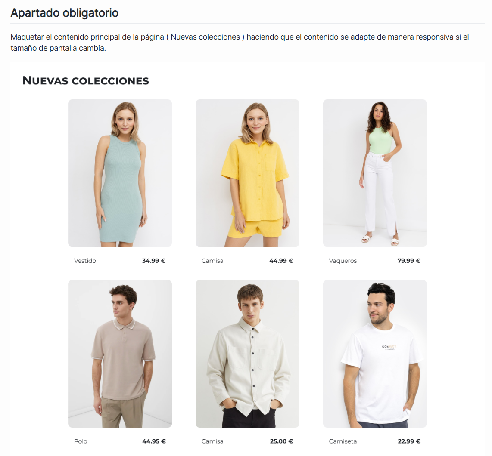

# Código HTML: 
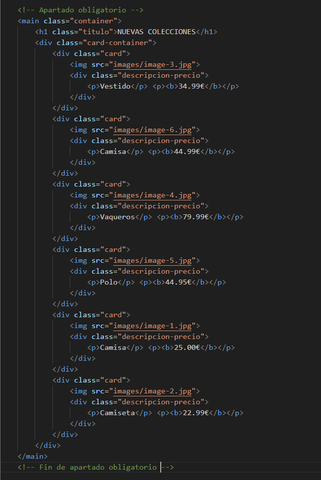

# Código CSS: 
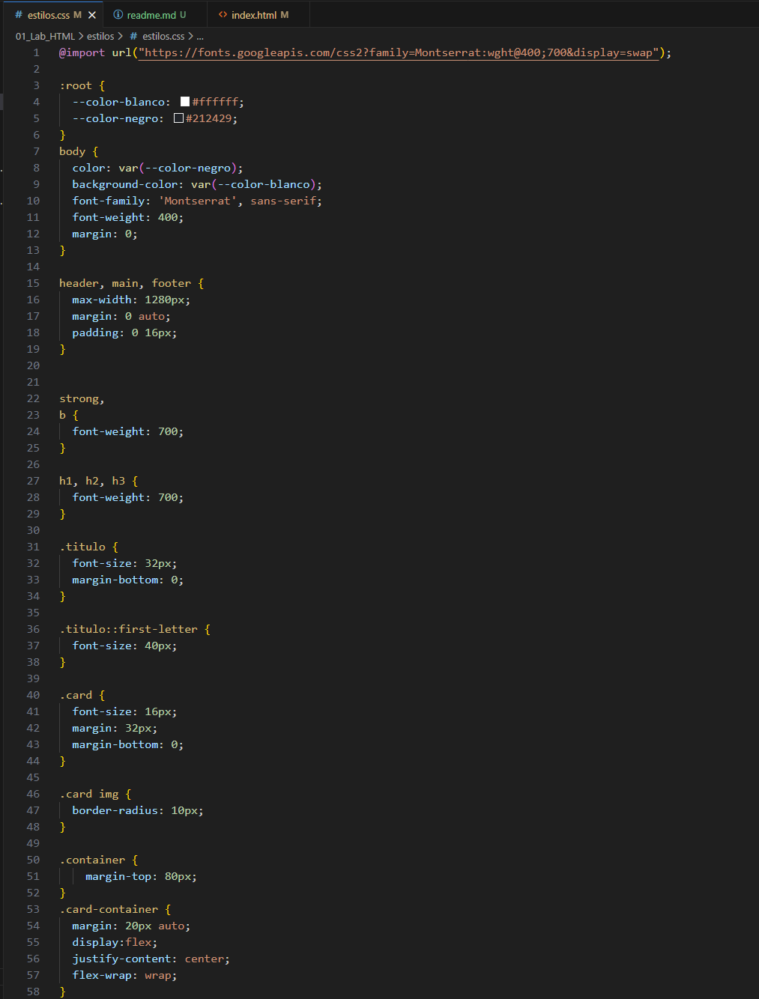 
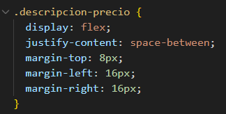

# Resultado del apartado obligatorio (El responsivo está en la foto):
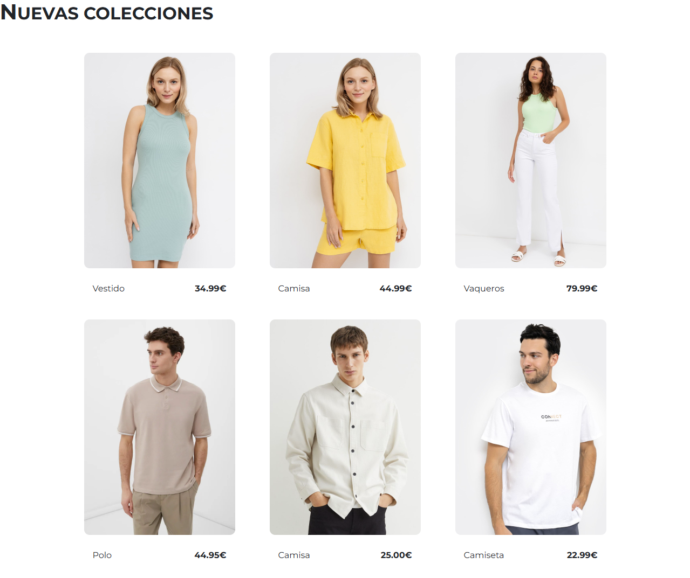

# Enunciado opcional #1: Barra de navegación y footer.
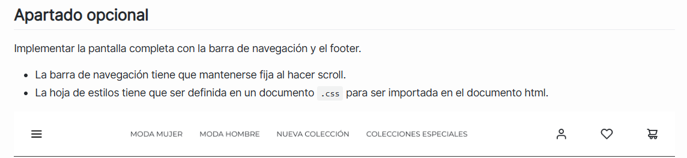

# Código HTML:
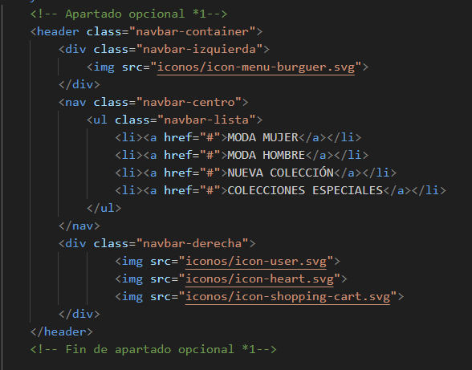
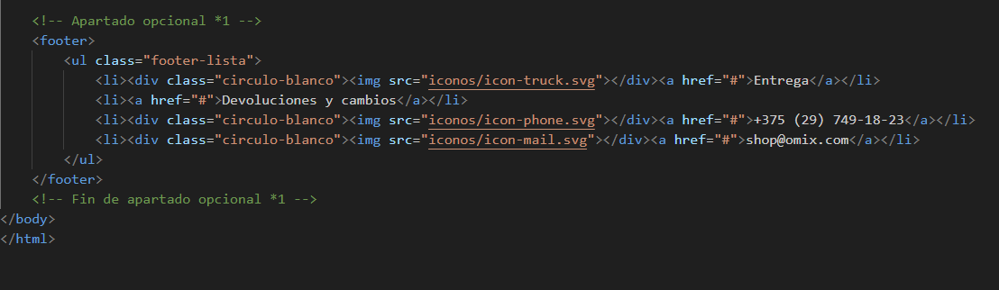

# Código CSS: 
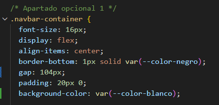 

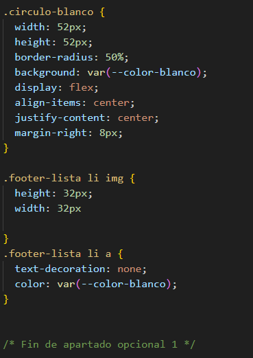

# El apartado también incluye hacer que la barra de navegación esté fijada y que todo el css sea importado de un archivo externo.
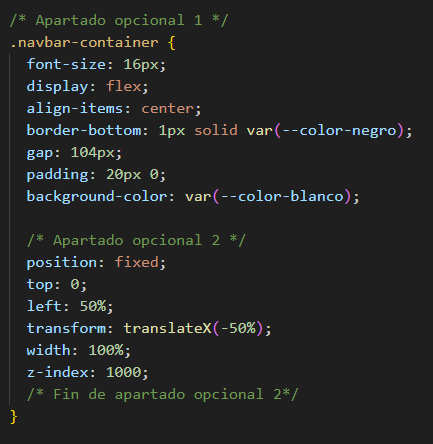
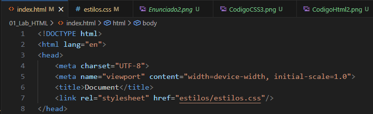

# Resultado del apartado opcional (Parece recortado, pero intuí que es así, ya que en el ejemplo se vé como si hubiese espacios a los lados, cuando realmente lo que trabajamos es solo lo mostrado en la siguiente captura):
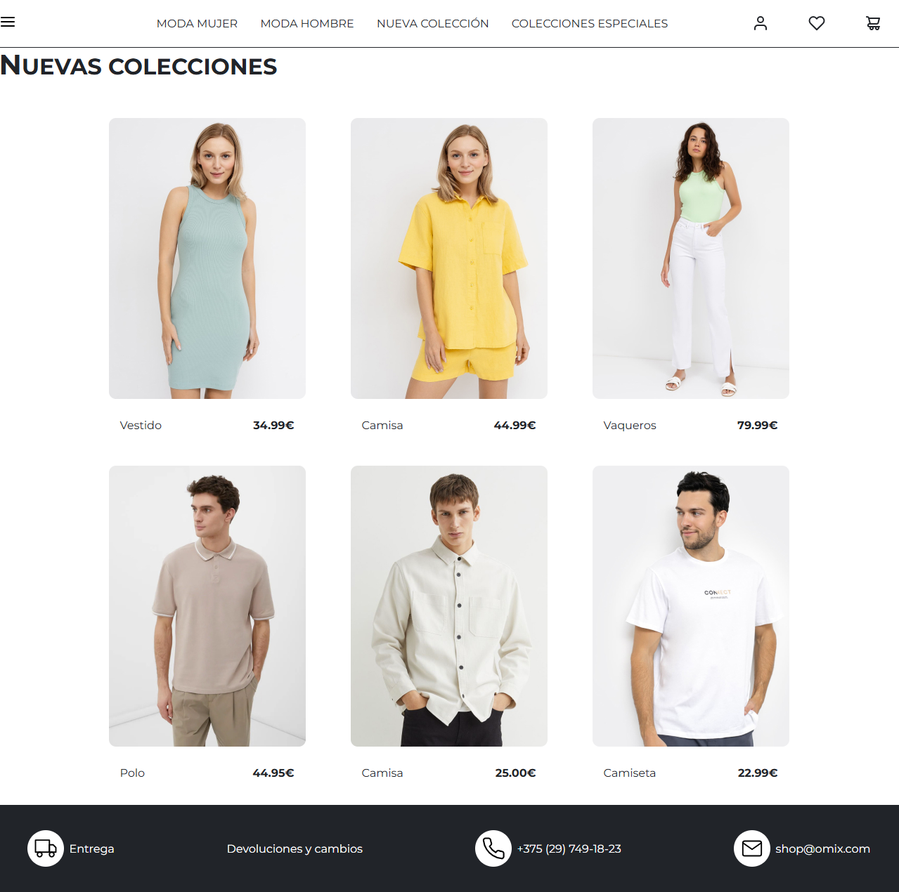

# Enunciado extra: Diseño responsivo con un ancho máximo de 920px:
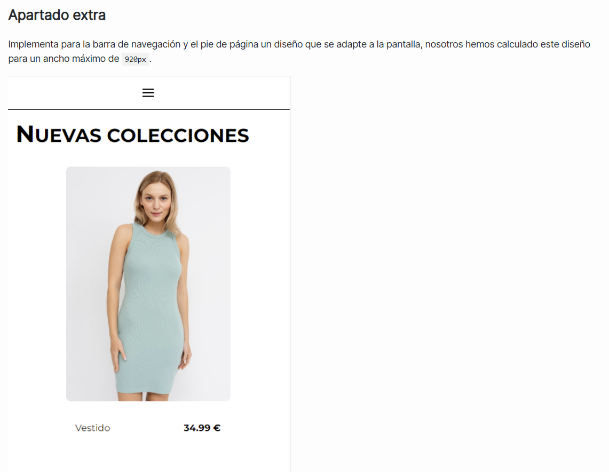
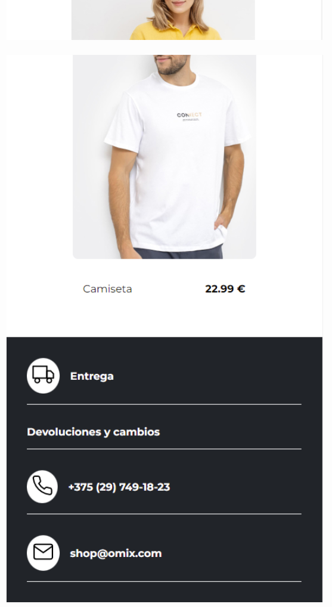

# Código CSS, hay comentarios importantes:
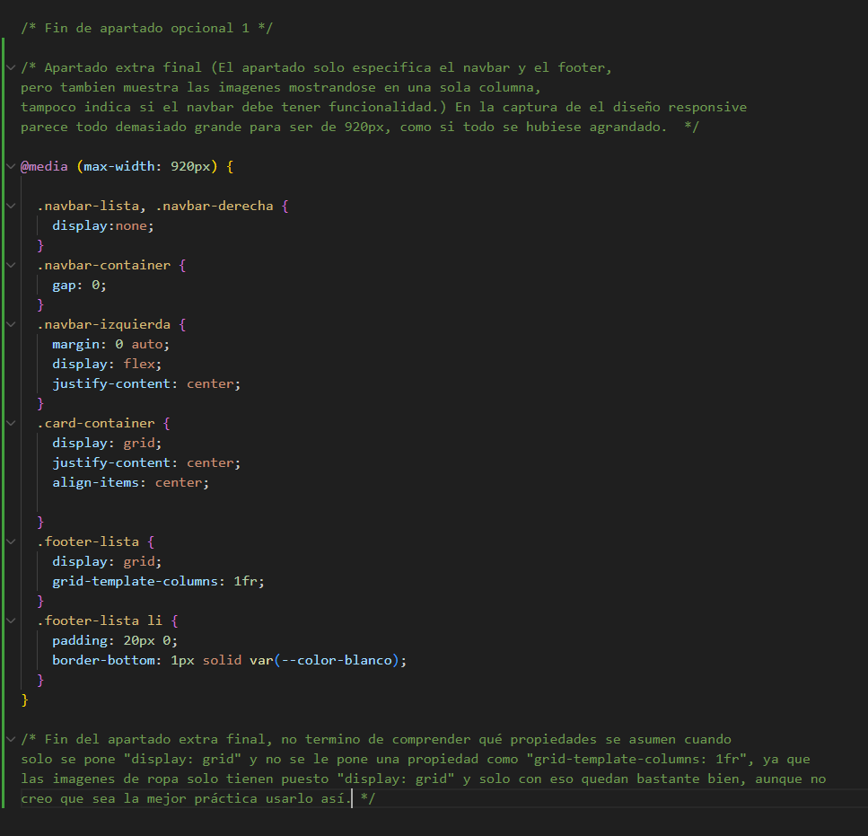 

# Resultado del apartado extra (mirar los comentarios anteriores):

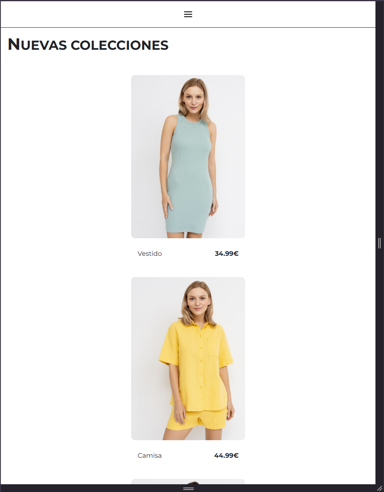
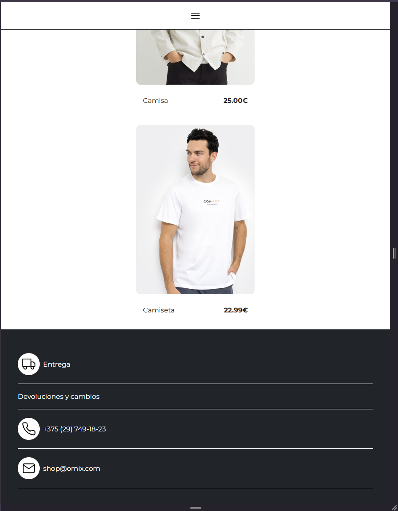